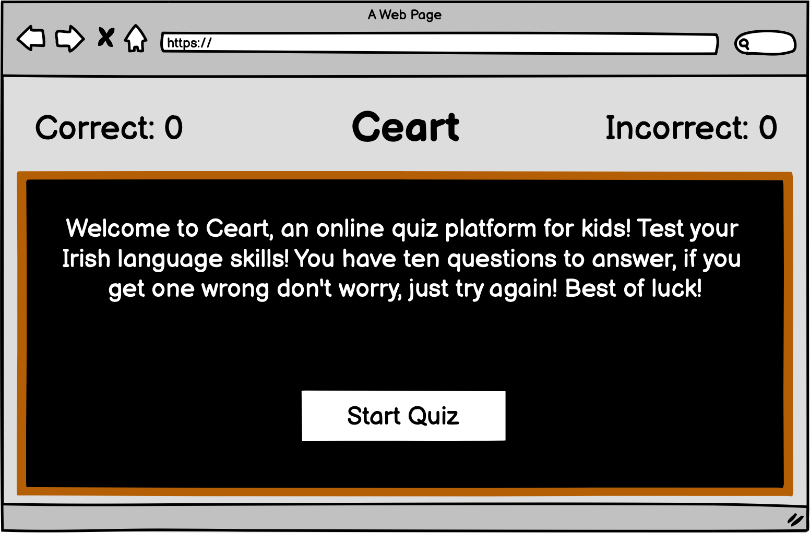
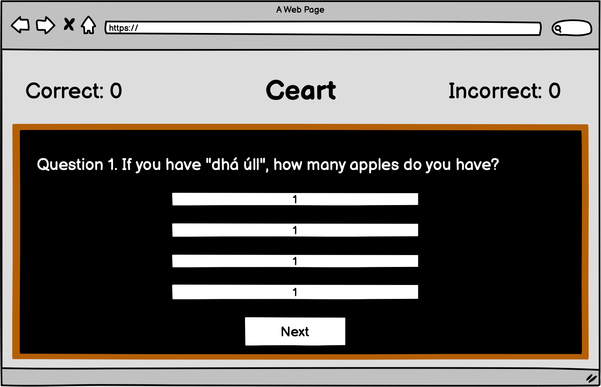
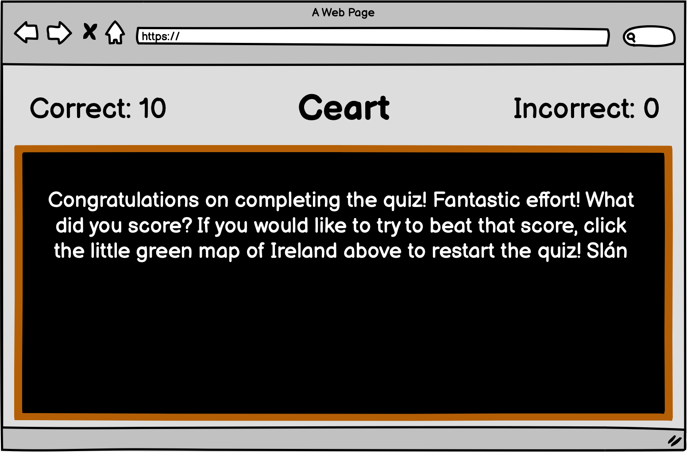

https://www.digitalocean.com/community/tutorials/how-to-add-a-favicon-to-your-website-with-html favicon link code copied from here

https://www.youtube.com/watch?v=pA8103S-yqk to add favicon to site, it was not made clear through love maths project

https://stackoverflow.com/questions/2573979/force-page-reload-with-html-anchors-html-js add refresh feature once logo is clicked

https://stackoverflow.com/questions/11404744/css-media-queries-max-width-or-max-height used to set media query screen height

I came across bug cannot set property display of underfined displaying buttons, found info on https://stackoverflow.com/questions/12194435/cannot-set-property-display-of-undefined


Created logo using https://logomakr.com/

Google fonts

https://www.youtube.com/watch?v=MLfAW55_4cY - followed first half of video to apply hover overlays to buttons

https://www.w3schools.com/cssref/pr_border-style.asp to remove border

script.js:25 Uncaught TypeError: Cannot read property 'question' of undefined
    at showQuestion (script.js:25)
    at setNextQuestion (script.js:21)
    at HTMLButtonElement.startQuiz (script.js:15)

https://www.youtube.com/watch?v=riDzcEQbX6k - set up quiz


<h1 align="center">CEART - IRISH QUIZ FOR KIDS</h1>


---

[Live Website](https://conorwalsh1.github.io/Portfolio-Project-1/)

[Github Repository](https://github.com/conorwalsh1/Portfolio-Project-1)

---

# About

Welcome to Ceart (Ceart is the Irish translation of the word 'Correct'), an online multiple choice quiz for kids that tests their knowledge of the Irish language. I set out to create a quiz that is both easy to navigate and clear in it's intent.

As most people who learn the Irish language do so when they are a child, I prioritised a landing page which welcomes the site visitor using clear and easy to read English in a small paragraph with a large button that reads "Start Quiz". The welcome message informs the user that they have ten questions to answer and it also encourages the user to try again, even if they are not right the first time. Once the start quiz button is pressed, the welcome message will disappear and the quiz will begin. 

The site user will be asked a question at the top of the screen under which they will have four buttons with each button containing a possible answer. If the correct button is clicked, the button selected will turn green and the "Correct" score tracker will increment by 1, however if they choose incorrectly, the button selected will turn red and the "Incorrect" score tracker will increment by 1 for each wrong answer selected

The quiz is comprised of a total of ten questions with each question being labelled with a number to show the user where they stand in terms of total questions remaining. Once the tenth question has been answered, the quiz area will be cleared of questions and answer buttons and a closing message will inform the user that they have reached the end of the quiz. The closing message will congratulate them on completing the quiz and will ask them how they fared. The user will be informed that if they would like to restart they quiz, they need only click on the little green map of Ireland thaat remains at the top of the page. Their final scores will be stored at the top of the page, showing how many answers they were correct and how many were incorrect.

This website was built using a Macbook Pro 13". 

## User Experience (UX)

-   ### User stories

    -   #### First Time Visitor Goals

        1. As a First Time Visitor, I want to easily understand the main purpose of the site and I want to feel encouraged to click the Start Quiz button and for the button to be clearly visible.
        2. As a First Time Visitor, I want to be able to easily navigate throughout the site from the start of the quiz to the end.
        3. As a First Time Visitor, I want to feel a sense of accomplishment in completing the quiz. I want to be able to see my result to see how good my Irish skills are.

    -   #### Returning Visitor Goals

        1. As a Returning Visitor, I want to be able to challenge myself to see if I can get a better score.
        2. As a Returning Visitor, I want to have fun whilst also learning more about the Irish language.
        3. As a Returning Visitor, I want to be able to navigate my way through the site with ease and without confusion.

    -   #### Frequent User Goals
        1. As a Frequent User, I want to check to see if my results are improving as time goes on, getting less incorrect answers and more correct.
        2. As a Frequent User, I want to check to see if there are any new questions sorted by different topics or difficulty.
        3. As a Frequent User, I want to feel that I am learning more about the Irish language as time goes on.

-   ### Design
    -   #### Colour Scheme
        -   The main colours used are grey, green, orange, black, brown and red. I used a black square with a brown boarder to create what looks like a blackboard that teachers use in Irish classrooms to make the site user feel like they are in a learning environment. I used a grey background so this blackboard would pop against it. I used the colour green for both the map of Ireland in the logo, favicon and as a transition effect if the correct answer is selected. I used white for the button backgrounds and for the writing on the blackboard. I used black for writing inside the buttons and outside the quiz area. I used red as a transition effect if the icorrect answer is selected. I used the colour combination of green, white and orange to symbolise Ireland.
    -   #### Typography
        -   The Coming Soon font is used throughout the body with the only expection being that Arial ised used in the buttons as it makes them look more crisp and easy to read. I chose Coming Soon as I wanted to have a font that resembled handwriting on the blackboard that would be done in chalk in a standard classroom. I feel it works very effectively. I also chose to use it for the correct and incorrect scores as it is laidback and child friendly. I chose Arial for all the buttons as it clear for the user when they want to make a decision on what the answer is.
    -   #### Imagery
        -   Imagery does not play a part on this site currently. It is a future feature that could be added to the questions. Though not technically an image, there is a map of Ireland in the logo what was created using an external logo creator called https://logomakr.com/. The quiz area blackboard does act like an image as it holds all information about the quiz within it but is not technically an image. The only images that appear in the images folders are that of the favicon, the logo and the responsibve test.

*   ### Wireframes

    -   I chose to use Balsamiq Wireframes to sketch out how I hoped for the site to look. I will post three pictures below, showing how I wanted the start of the quiz, the quiz questions and the end of the quiz to appear.

    <h2 align="center">Start of Quiz</h2>

    

    <h2 align="center">Quiz Questions</h2>

    

    <h2 align="center">End of the Quiz</h2>

    

    
## Features

-   Responsive on all device sizes. On wider screens the questions and buttons stretch out to make use of space but on smaller screens the media queries ensure the quiz is adaptive and clean

-   Correct and Incorrect scores increment as according to users selecting the correct answer ot incorrect answer.

-   When hovered over, the 'Start Quiz' and 'Next' buttons transition to orange to encourage user to click.

-   Accessibility has been added in terms of both aria labels and aria labelled by to ensure the site is usable for anyone using screen readers.

-   Icons imported from Font Awesome and applied where necessary (e.g applied to all list items under Visit Us and Contact divs).

-   The 'Next' button toggles through questions until there are no questions left to display, at which point the closing message appears on screen.

-   Ten seperate questions with different answers. If the correct answer is selected, button turns green. If incorrect button selected, button turns red.

-   Welcome message upon loading the quiz informing player how the quiz works.

-   Closing message upon completing the quiz congratulating the player, asking them how they scored and directing them to click the green map of Ireland in the logo if they would like to restart.

-   The green map of Ireland in the logo contains a link so that when it is clicked, it will refresh the page, thereby restarting the quiz.

## Features I Would Have Liked To Add

-   Different topics of quiz questions, such as sport, history, geography.

-   Different variations of difficulty to keep site users coming back.

-   A highscore page that stores users names and scores.

-   A timer so that players can test themselves to try and beat their previous times.


## Technologies Used

### Languages Used

-   [HTML5](https://en.wikipedia.org/wiki/HTML5)
-   [CSS3](https://en.wikipedia.org/wiki/Cascading_Style_Sheets)
-   [Javascript](https://en.wikipedia.org/wiki/JavaScript)

### Frameworks, Libraries & Programs Used

1. [Google Fonts:](https://fonts.google.com/)
    - Google fonts were used to import the 'Coming Soon' font into the style.css file which is used throughout the body of the project.
1. [Balsamiq:](https://fontawesome.com/)
    - Balsamiq was used to draft up the wireframes for the project which helped me visualise what I wanted to achieve.
1. [Git](https://git-scm.com/)
    - Git was used for version control by utilizing the Gitpod terminal to commit to Git and Push to GitHub.
1. [GitHub:](https://github.com/)
    - GitHub is used to store the projects code after being pushed from Git.
1. [Logo Makr:](https://logomakr.com/)
    - Logo Makr was used to create the Ceart logo which included the green map of Ireland.
1. [Responsive Design:](http://ami.responsivedesign.is/)
    - Responsive design was used to create responsive design imitator image.


## Testing

The W3C Markup Validator and W3C CSS Validator Services were used to validate every page of the project to ensure there were no syntax errors in the project.

-   [W3C Markup Validator](https://jigsaw.w3.org/css-validator/#validate_by_input) - [Results](https://github.com/)
-   [W3C CSS Validator](https://jigsaw.w3.org/css-validator/#validate_by_input) - [Results](https://github.com/)

### Testing User Stories from User Experience (UX) Section

-   #### First Time Visitor Goals

    1. As a First Time Visitor, I want to easily understand the main purpose of the site and learn more about the organisation.

        1. Upon entering the site, users are automatically greeted with a clean and easily readable navigation bar to go to the page of their choice. Underneath there is a a minimalist image of the 'Rock'.
        2. The main points are made immediately with the the nav bar at the top of the page and the landing image below.
        3. The user has two options, click on the nav links or scroll down, both of which will lead to the same place, to learn more about the 'Rock of Cashel'.

    2. As a First Time Visitor, I want to be able to easily be able to navigate throughout the site to find content.

        1. The site has been designed to be fluid and never to entrap the user. At the top of each page there is a clean navigation bar, each link describes what the page they will end up at clearly.
        2. The nav bar being fixed ensures the user always has somewhere to go and doesn't feel trapped as they get to the bottom of the page.

    3. As a First Time Visitor, I want to look for testimonials to understand what their users think of them and see if they are trusted. I also want to locate their social media links to see their following on social media to determine how trusted and known they are.

        1. Once the new visitor has read the History and Visit Us, they will notice the Contact section.
        2. At the bottom of the Contact Us page in the footer, the user is told that alternatively they can contact the organisation on social media which highlights the links to them.

-   #### Returning Visitor Goals

    1. As a Returning Visitor, I want to find information on the most recent photo competition.

        1. The competition link will always sit in the fixed header, meaning the site browser need never look far to gain access.
        2. They will be directed to a separate page with a description on what event is ongoing, when voting is open and who can they contact for any further information required.
        3. The pictures entered in the competition will be listed below.

    2. As a Returning Visitor, I want to find the best way to get in contact with the organisation with any questions I may have.

        1. The navigation bar clearly highlights the "Contact" Page.
        2. Here they can gather our phone number and email or are told that alternatively they can message the organisation on social media.
        3. The footer contains links to the organisations Facebook, Twitter, Instagram and Youtube pages.
        4. Whichever link they click, it will be open up in a new tab to ensure the user can easily get back to the website.
        5. The email button is set up to automatically open up your email app and autofill there email address in the "To" section.

    3. As a Returning Visitor, I want to find the Facebook link so that I can join and interact with others in the community.
        1. The Facebook Page can be found at the footer of every page and will open a new tab for the user and more information can be found on the Facebook page.

-   #### Frequent User Goals

    1. As a Frequent User, I want to check to see if there are any new details about the photo competition.

        1. The user would already be comfortable with the website layout and can easily click the banner message.

    2. As a Frequent User, I want to check to see if there are any changes in admission prices or opening times.

        1. The user would already be comfortable with the website layout and can easily click the Visit Us link

### Further Testing

-   The Website was tested on Google Chrome, Internet Explorer, and Safari browsers.
-   The website was viewed on a variety of devices such as Desktop, Laptop, iPad, iPhone7, & iPhoneX.
-   A large amount of testing was done to ensure that all pages were linking correctly.
-   Friends and family members were asked to review the site and documentation to point out any bugs and/or user experience issues.

### Known Bugs

-   When the nav bar is opened through the collapsible burger icon on iPhones and iPad, the links for History, Visit Us and Contact divs will bring the user to the relevant part of the site, however they must close the drop down using the "X" icon on the top right of the page to display the information as requested. The issue does not effect Home or Competition links.

-   When tested on an iPhone 7, the social media links tend to float to the right, even though there is no rule to state such. This problem does not appear when testing responsiveness using Chrome Dev Tools.

-   No errors when HTML and CSS are ran through respective WS3 validators.

## Deployment

### GitHub Pages

The project was deployed to GitHub Pages using the following steps...

1. Log in to GitHub and locate the [GitHub Repository](https://github.com/)
2. At the top of the Repository (not top of page), locate the "Settings" Button on the menu.
    - Alternatively Click [Here](https://raw.githubusercontent.com/) for a GIF demonstrating the process starting from Step 2.
3. Scroll down the Settings page until you locate the "GitHub Pages" Section.
4. Under "Source", click the dropdown called "None" and select "Master Branch".
5. The page will automatically refresh.
6. Scroll back down through the page to locate the now published site [link](https://github.com) in the "GitHub Pages" section.

### Forking the GitHub Repository

By forking the GitHub Repository we make a copy of the original repository on our GitHub account to view and/or make changes without affecting the original repository by using the following steps...

1. Log in to GitHub and locate the [GitHub Repository](https://github.com/)
2. At the top of the Repository (not top of page) just above the "Settings" Button on the menu, locate the "Fork" Button.
3. You should now have a copy of the original repository in your GitHub account.

### Making a Local Clone

1. Log in to GitHub and locate the [GitHub Repository](https://github.com/)
2. Under the repository name, click "Clone or download".
3. To clone the repository using HTTPS, under "Clone with HTTPS", copy the link.
4. Open Git Bash
5. Change the current working directory to the location where you want the cloned directory to be made.
6. Type `git clone`, and then paste the URL you copied in Step 3.

```
$ git clone https://github.com/YOUR-USERNAME/YOUR-REPOSITORY
```

7. Press Enter. Your local clone will be created.

```
$ git clone https://github.com/YOUR-USERNAME/YOUR-REPOSITORY
> Cloning into `CI-Clone`...
> remote: Counting objects: 10, done.
> remote: Compressing objects: 100% (8/8), done.
> remove: Total 10 (delta 1), reused 10 (delta 1)
> Unpacking objects: 100% (10/10), done.
```

Click [Here](https://help.github.com/en/github/creating-cloning-and-archiving-repositories/cloning-a-repository#cloning-a-repository-to-github-desktop) to retrieve pictures for some of the buttons and more detailed explanations of the above process.

## Credits

### Code

-   [CSS Tricks](https://css-tricks.com/all-about-mailto-links/) : I wanted to have it so when you click on the email in the Contact section it opened a new email with the Rock of Cashel email already named as the recipient, so I followed this tutorial to achieve desired effect.

-   [Stack Overflow](https://stackoverflow.com/questions/29451382/navigation-bar-being-hidden-behind-pics) : I found my fixed nav bar kept disappearing behind images as I scrolled through page. Searched online and found this link which recommended setting z-index to a high figure which solved problem.

-   [YouTube](https://www.youtube.com/watch?v=S-JyJCVx_4Y) : Followed first part of tutorial using the video linked to figure out how to add fixed nav bar. I tried to follow the video futher as I wanted to create a burger icon to shrink the menu when the screen size was reduced but after multiple attempts I had to give up as it was not turning out like the video and was taking up a lot of time.

-   [YouTube](https://www.youtube.com/watch?v=AkK8yHC4TlI) : Though I spent a lot of time earlier on trying to find a way to make the burger icon work, I felt it would really help the flow of the site as I had four nav anchors which took up a lot of space once site was displayed on smaller screen sizes, so I followed this tutorial, persevered and managed to get it working.

-   [YouTube](https://www.youtube.com/watch?v=exb2ab72Xhs) : Followed tutorial here to acheive hover transition effect when mouse placed over tapestry image but later discarded the effect as I found it difficult to maintain effect upon responsive shrinking and felt it was superflous as time went on and I was spending far too much time striving for a relatively unnoticeable effect.

-   [Brand Palettes](https://brandpalettes.com/) : I acquired accurate colors for social media icons from Brand Palettes.

-   [Computer Hope](https://www.computerhope.com/issues/ch000049.htm) : Added internal nav link for history nav bar at top of page using information sourced from link above.

-   [The University of Vermont](https://www.uvm.edu/~bnelson/computer/css/wrappingtextaroundimages.html) : I struggled to wrap the text around the picture in the 'History' section but found relevant information through link above.

-   [Bootstrap4](https://getbootstrap.com/docs/4.4/getting-started/introduction/): Bootstrap Library used throughout the project mainly to make site responsive using the Bootstrap Grid System.

-   [MDN Web Docs](https://developer.mozilla.org/) : For Pattern Validation code. Code was modified to better fit my needs and to match an Irish phone number layout to ensure correct validation. Tutorial Found [Here](https://developer.mozilla.org/en-US/docs/Web/HTML/Element/input/tel#Pattern_validation)

### Problems Overcame

-   As mentioned above, once I had completed everything else on the site I was left unsatisfied after numerous attempts of playing with the code. I could not get the burger item to display the drop down nav list vertically. In the video I mentioned to get to that point, the coder used display: block to align the nav links vertically, but it would not work the same on my system. I decided to give it one more attempt to fix it as it was the only part of the project I was left unsatisfied with. 

    I used Chrome Dev Tools to play around with different display attributes and found that 'grid' alligned the nav list vertically, but the spacing was too far apart and it was inverted. I then tried display flex which seemed to work better. It also gave me options such as flex direction and justify content to play around with and I was able to obtain the desired layout. I then tweaked the line height and list margin until I alligned the list in the desired. I had to walk away from the issue multiple times left frustrated but I was glad to have over come this issue as it really tidies up the flow of the site.

### Content

-   [Heritage Ireland](https://heritageireland.ie/places-to-visit/rock-of-cashel/) : History paragraph taken from this link.

-   Code Institute README.md template.

-   All other content was written by Conor Walsh.


### Media

-   All Images were taken from [Google Images](https://www.google.com/imghp?hl=EN)

### Acknowledgements

-   I would like to thank my mentor Maria Hynes for guiding me along the right path throughout our mentoring sessions. There were times I struggled with getting the way I wanted the code to look out of my head and onto the screen, but she gave me great motivation to persevere and I am very grateful for her assistance. 


